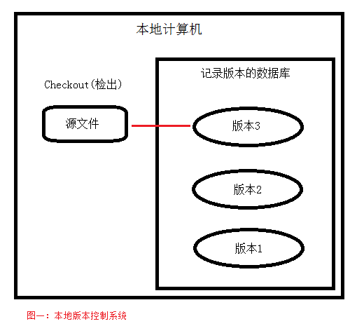
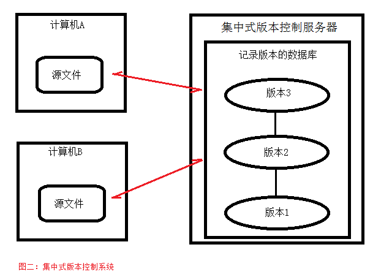
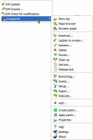

# 版本控制系统（vertion control system, VCS）

版本控制是一种记录一个或若干个文件变化，以便我们在将来某个时候查看（回溯）特定版本的修订情况的系统。在实际的项目中，我们使用它帮我们管理项目的源代码。

## 版本控制系统的分类

### 本地版本控制系统

大多数本地版本控制系统都是使用某种简单的数据库记录文件每次更新的差异。

其中最流行的一种叫 RCS，它的工作原理是在硬盘上保存补丁集（补丁指的是文件修改前和修改后的变化），通过应用所有补丁，可以重新计算出各个版本的文件内容。

### 集中式版本控制系统

如何让在不同系统上的开发者协同工作呢？于是，集中式的版本控制系统就应运而生了。这类系统，比如 Subversion（SVN）都是采用一个单一的集中管理的服务器，保存所有文件的修订版本，需要协同工作的人都通过客户端连接到这台服务器，检出最新的文件或提交更新。

下面是 Subversion 安装后提供的功能：

### 分布式版本控制系统

Git 

## 下载安装 Git

Git 既有基于图形用户界面的客户端，也有基于命令行的客户端。

## 基于图形界面的客户端

Github 提供了一个基于图形界面的客户端。

https://desktop.github.com/

## 基于命令行的客户端

https://git-scm.com/downloads

